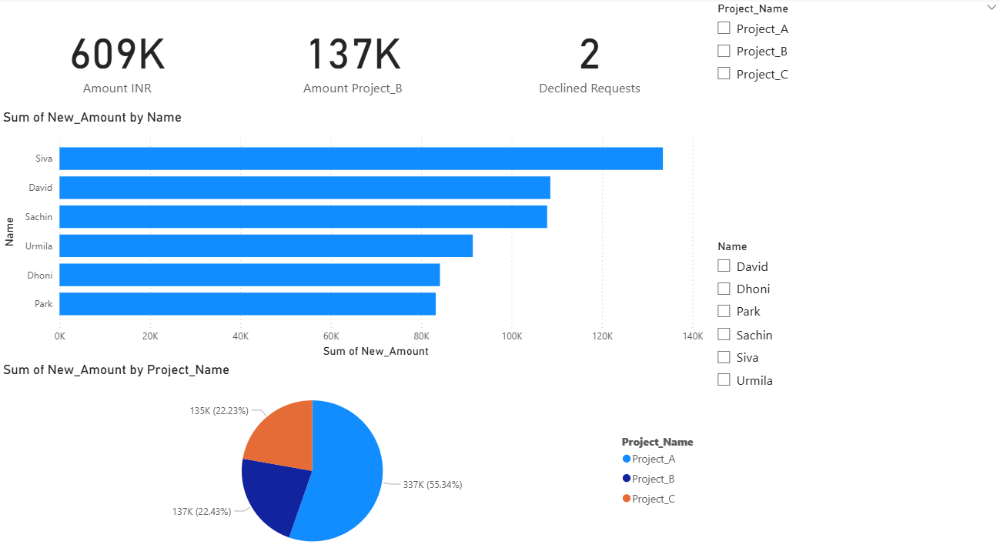

# 🎬 Box Office Movie Analysis (Power BI Project)

In this project, Power BI is used to analyze box office data for a set of movies. The aim is to create engaging visuals, uncover patterns, and extract meaningful insights from the dataset.

## 📊 Project Objectives
- Visualize total box office collections across movies
- Identify top-grossing movies and genres
- Analyze year-wise and genre-wise revenue trends
- Extract actionable insights to understand what drives box office success

## 📁 Project Structure

```
Box Office Analysis/
├── box-office-analysis.pbix # Power BI dashboard
├── data/
│ └── box_office_data.csv # Source dataset
├── images/
│ ├── dashboard-overview.png # Main dashboard preview
│ └── top-movies-chart.png # Chart visual (optional)
├── README.md
```

## 🖼️ Dashboard Preview



## 🔍 Key Insights
- **Top Genres**: Action and Adventure consistently lead in revenue generation.
- **Seasonal Trends**: Summer and holiday releases perform better in collections.
- **Ratings vs Revenue**: Higher IMDB ratings often correlate with better box office performance.
- **Outliers**: Some low-budget films with high ratings outperform big-budget releases.

## 🛠️ Tools Used
- Power BI Desktop
- EXCEL data format 
- DAX for calculated columns and measures

## 🚀 How to Run This Project
1. Clone this repository or download the ZIP
2. Open `box-office-analysis.pbix` in Power BI Desktop
3. Ensure `box_office_data.csv` is in the `data/` folder
4. Click on **Refresh** to load or update the data

## 👨‍💻 Author
Dhruv Saxena (https://github.com/drvsaxena)

## 📝 License
This project is licensed under the MIT License. Feel free to reuse or modify it.
